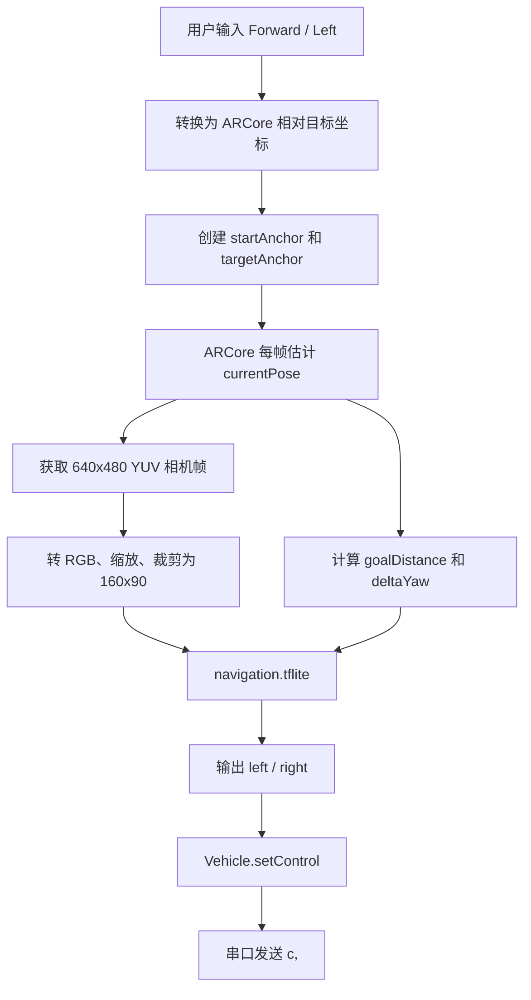

# OpenBot PointGoalNavigation 源码解析

本文基于当前 `dev/OpenBot/android` 源码，解释 OpenBot Android 端 `Point Goal Navigation` 功能的实际实现方式。这个功能不能简单理解成传统地图导航或 SLAM 导航；它更像是“ARCore 相对位姿 + 相机图像 + 学习策略网络”的点目标视觉导航 demo。

## 一句话结论

`PointGoalNavigation` 让用户输入一个相对于机器人当前位姿的二维目标点，例如“前方 1.0 m、左侧 0 m”。启动后，Android 手机用 ARCore 持续估计当前手机/机器人位姿，再把当前相机图像、目标距离、目标相对朝向送入 `navigation.tflite`。模型直接输出左右轮控制量，OpenBot 再通过 `Vehicle.setControl()` 下发给底盘。

也就是说，它不是靠地图、路径规划或障碍物几何建模来导航，而是依赖一个训练好的 TFLite 策略网络端到端地产生左右轮速度。

## 关键源码位置

- 功能入口：`robot/src/main/java/org/openbot/pointGoalNavigation/PointGoalNavigationFragment.java`
- ARCore 封装：`robot/src/main/java/org/openbot/pointGoalNavigation/ArCore.java`
- TFLite 策略封装：`robot/src/main/java/org/openbot/tflite/Navigation.java`
- 目标输入弹窗：`robot/src/main/java/org/openbot/pointGoalNavigation/SetGoalDialogFragment.java`
- UI 布局：`robot/src/main/res/layout/fragment_point_goal_navigation.xml`
- 目标输入布局：`robot/src/main/res/layout/set_goal_dialog_view.xml`
- 功能入口菜单：`robot/src/main/java/org/openbot/common/FeatureList.java`
- Fragment 路由：`robot/src/main/res/navigation/nav_graph.xml`
- 模型配置：`robot/src/main/assets/config.json`
- 内置模型：`robot/src/main/assets/networks/navigation.tflite`

## 功能入口与运行前提

主界面功能列表中有一个 `Point Goal Navigation` 子项。点击后，`MainFragment` 会跳转到 `PointGoalNavigationFragment`。

这个 Fragment 的界面本身非常简单，只有一个全屏 `GLSurfaceView`，用于显示 ARCore 相机背景和目标标记。真正的逻辑不在 XML，而在 `PointGoalNavigationFragment` 和 `ArCore` 两个 Java 类里。

运行前提有三类：

1. Android 相机权限。
2. 设备支持 ARCore，并且系统中可用 Google Play Services for AR。
3. OpenBot 车辆通信链路可用，因为最终控制会调用 `Vehicle.setControl()`。

项目的 `robot/build.gradle` 依赖了 `com.google.ar:core:1.29.0`，`AndroidManifest.xml` 中也声明了 `com.google.ar.core` 为 `optional`。但是代码里创建 ARCore `Session` 时仍然需要运行时 ARCore 服务。如果手机没有可用的 ARCore 运行环境，`setupArCore()` 会捕获 `UnavailableArcoreNotInstalledException`、`UnavailableDeviceNotCompatibleException`、`UnavailableApkTooOldException` 等异常，并弹出 ARCore failure 信息。

这解释了为什么在中国大陆没有 Google Play 服务时很难直接实机测试：模型文件本身是内置的，不需要联网下载；真正卡住的是 ARCore 运行服务和设备兼容链路。

## 用户输入的目标是什么

进入功能后会弹出 `Set Goal` 对话框。用户填写两个数：

- `Forward [m]`：目标在机器人前方多少米，默认 `1.0`。
- `Left [m]`：目标在机器人左侧多少米，默认 `0`。

这两个值允许为负数。README 中也说明：负的 forward 表示后方，负的 left 表示右侧。

源码中点击 `Start` 后会调用：

```java
startDriving(-left, -forward);
```

随后在 `startDriving()` 中有注释：

```java
// x: right, z: backwards
```

也就是说，用户用“前/左”的直觉坐标输入，代码再转换成 ARCore/OpenBot 使用的坐标：

- ARCore/OpenBot 这里把 `x` 轴正方向当作右侧。
- 把 `z` 轴正方向当作后方。
- 因此前方目标要变成负 `z`，左侧目标要变成负 `x`。

例如默认输入 `Forward = 1.0, Left = 0`，实际目标平移就是 `(x=0, z=-1.0)`，即当前位姿前方 1 米。

## ARCore 在这里做了什么

`ArCore` 类负责封装 ARCore `Session`、相机画面、位姿和目标锚点。它不做 SLAM 地图输出，也不做路径规划；它主要提供两件事：

1. 当前手机/机器人位姿 `currentPose`。
2. 用户目标点的 ARCore 锚点 `targetAnchor`。

启动驾驶时，代码先：

1. 清除旧锚点。
2. 把当前 ARCore pose 保存为起点锚点。
3. 用起点 pose 叠加用户输入的平移，创建目标锚点。

核心逻辑是：

```java
arCore.setStartAnchorAtCurrentPose();
Pose startPose = arCore.getStartPose();
arCore.setTargetAnchor(startPose.compose(Pose.makeTranslation(goalX, 0.0f, goalZ)));
```

之后每一帧，`ArCore.onDrawFrame()` 会：

1. 调用 `session.update()` 获取 ARCore 帧。
2. 检查相机 tracking 状态。
3. 从 ARCore camera 读取当前 pose。
4. 读取目标 anchor pose。
5. 调用 `frame.acquireCameraImage()` 获取 CPU 图像。
6. 把 `NavigationPoses`、`ImageFrame`、相机内参和时间戳回调给 `PointGoalNavigationFragment.onArCoreUpdate()`。

如果 ARCore 不再处于 `TRACKING` 状态，或者相机会话暂停、不可用，Fragment 会停止底盘并弹窗提示。

## 相机配置和图像预处理

`ArCore.setCameraConfig()` 明确选择：

- 后置摄像头。
- 30 FPS。
- CPU 图像尺寸必须是 `640x480`。
- 如果有多个可用配置，选择 GPU texture size 更小的配置。

每次导航更新时，`PointGoalNavigationFragment` 会把 ARCore 的 `YUV_420_888` 图像转成 RGB bitmap：

1. 原始 CPU 图像尺寸通常为 `640x480`。
2. 按 `160 / 480 = 1/3` 缩放，得到约 `213x160`。
3. 再裁剪 `Bitmap.createBitmap(bitmap, 0, 30, 160, 90)`，得到模型需要的 `160x90` 图像。

所以模型输入图像不是完整相机画面，而是缩放后从左上 x=0、y=30 开始截取的 `160x90` 区域。这个裁剪方式是硬编码的，和 `navigation.tflite` 的训练输入尺寸匹配。

像素进入 TFLite 前会在 `Navigation.addPixelValue()` 中归一化到 `[0, 1]`：

```java
channel = channel / 255.0f
```

## 模型输入与输出

`config.json` 中配置了一个导航模型：

```json
{
  "class": "NAVIGATION",
  "type": "GOALNAV",
  "name": "PilotNet-Goal.tflite",
  "path": "networks/navigation.tflite",
  "inputSize": "160x90"
}
```

不过 `PointGoalNavigationFragment.startDriving()` 并没有从模型管理器动态选择模型，而是直接构造了一个固定模型对象：

```java
new Model(
    0,
    CLASS.NAVIGATION,
    TYPE.GOALNAV,
    "navigation.tflite",
    PATH_TYPE.ASSET,
    "networks/navigation.tflite",
    "160x90");
```

`Navigation.java` 中可以看到模型有两个输入：

- `serving_default_img_input:0`：形状必须是 `[1, 90, 160, 3]`。
- `serving_default_goal_input:0`：3 个 float，分别是：
  - `goalDistance`
  - `sin(deltaYaw)`
  - `cos(deltaYaw)`

其中 `goalDistance` 是当前 pose 到目标 pose 在水平面上的欧氏距离，只使用 `x` 和 `z`：

```java
sqrt((goal.x - current.x)^2 + (goal.z - current.z)^2)
```

`deltaYaw` 是机器人当前朝向和“指向目标方向”之间的偏航角差。代码不是直接输入角度，而是输入 `sin(deltaYaw)` 和 `cos(deltaYaw)`，这样可以避免角度在 `pi` 和 `-pi` 边界附近的不连续问题。

模型输出是一个 `float[1][2]`：

```java
float[][] predicted_ctrl = new float[1][2];
```

这两个值会被包装成：

```java
new Control(predicted_ctrl[0][0], predicted_ctrl[0][1])
```

也就是左轮和右轮的归一化控制量。`Control` 构造函数会把每个值夹到 `[-1, 1]`。`Vehicle.sendControl()` 再乘以 `speedMultiplier`，默认代码中是 `192`，然后通过串口协议发送：

```text
c<left>,<right>\n
```

因此，PointGoalNavigation 的控制输出不是“线速度 + 角速度”，而是直接输出 OpenBot 差速底盘左右轮命令。

## 每帧控制循环

完整闭环可以概括为：



对应到 `PointGoalNavigationFragment.onArCoreUpdate()`，每帧做的事情是：

1. 如果 `isRunning == false`，直接忽略。
2. 计算当前到目标距离。
3. 如果距离小于 `0.15 m`，认为到达目标，停止底盘。
4. 否则计算目标相对偏航。
5. 取当前相机图像并转成 `160x90` bitmap。
6. 调用 `navigationPolicy.recognizeImage(bitmap, distance, sinYaw, cosYaw)`。
7. 把模型输出 `Control` 交给 `vehicle.setControl(control)`。

## 停车与异常处理

这个功能的安全逻辑比较简单，主要有三类停止：

1. 到达目标：当 `goalDistance < 0.15f` 时，调用 `stop()`，播放 `Goal reached.`，并弹出信息框。
2. ARCore tracking 丢失：`onArCoreTrackingFailure()` 中调用 `stop()`，播放 `Tracking lost.`，并弹出信息框。
3. ARCore session 暂停：`onArCoreSessionPaused()` 中调用 `stop()`，播放 `AR Core session paused.`，并弹出信息框。

`stop()` 的动作是：

```java
arCore.detachAnchors();
vehicle.stopBot();
isRunning = false;
```

这里没有复杂状态机，也没有短时重定位、避障优先级、通信异常仲裁等逻辑。避障能力如果存在，主要隐含在 `navigation.tflite` 策略网络的训练行为里，而不是显式代码规则。

## 它没有做什么

结合源码可以明确几点：

- 没有构建全局地图。
- 没有使用 SLAM 路径规划。
- 没有 A*、DWA、TEB 等传统局部规划器。
- 没有显式障碍物检测模块。
- 没有用深度图参与当前控制。`DepthFrame` 类存在，但当前 `ArCore` 配置没有启用 depth，`PointGoalNavigationFragment` 也没有使用 `DepthFrame`。
- 没有用相机内参参与当前控制。`CameraIntrinsics` 会被回调传入，但 `onArCoreUpdate()` 中没有实际使用它。
- 没有用 Google Maps 或网络地图。所谓 point goal 是相对当前位置的局部目标点，不是地图上的经纬度点。

## 对本项目的意义

对“自主跟随购物车”项目来说，PointGoalNavigation 值得借鉴的地方是：

1. Android 手机可以承担上位机主脑，直接跑 TFLite 策略并下发左右轮命令。
2. ARCore 可以提供短距离相对位姿，但它依赖 Google ARCore 运行环境，国内实机可用性不稳定。
3. 端到端策略网络可以把图像和目标向量直接映射到差速控制，但这要求训练数据和真实场景分布足够接近。
4. 当前实现安全兜底较薄，不适合作为购物车首版安全策略直接照搬。

如果本项目首版继续保持“OpenBot + Android 手机 + MCU + 差速底盘”的主线，更现实的参考方式是：

- 复用它的“Android 端模型推理 -> `Vehicle.setControl()` -> 下位机串口命令”链路。
- 不依赖 ARCore 作为核心能力，因为目标手机环境可能无法稳定安装和运行 Google Play Services for AR。
- 对购物车跟随主线，应继续采用已有的目标检测、目标锁定、ReID 辅助、距离控制和安全状态机，而不是把 PointGoalNavigation 当作可直接替换的导航模块。

## 简化伪代码

```java
onStartPointGoalNavigation() {
  askUserForForwardAndLeftMeters();
  requireCameraPermission();
  startArCoreSession();
}

startDriving(forward, left) {
  goalX = -left;      // ARCore x positive means right
  goalZ = -forward;   // ARCore z positive means backward

  startAnchor = currentArCorePose;
  targetAnchor = startAnchor.compose(translation(goalX, 0, goalZ));
  navigationPolicy = load("networks/navigation.tflite");
  isRunning = true;
}

onArCoreUpdate(currentPose, targetPose, cameraImage) {
  if (!isRunning) return;

  distance = horizontalDistance(currentPose, targetPose);
  if (distance < 0.15) {
    stop();
    showGoalReached();
    return;
  }

  deltaYaw = yawDifference(currentPose.forward, targetPose - currentPose);
  image = yuvToRgbResizeAndCrop(cameraImage, 160, 90);

  control = navigationPolicy.run(
      image,
      distance,
      sin(deltaYaw),
      cos(deltaYaw));

  vehicle.setControl(control.left, control.right);
}

onArCoreTrackingLostOrPaused() {
  stop();
  showFailureMessage();
}
```

